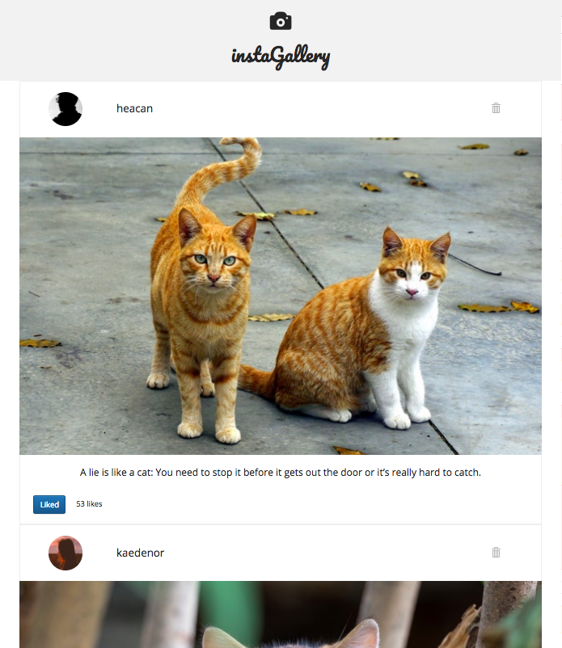
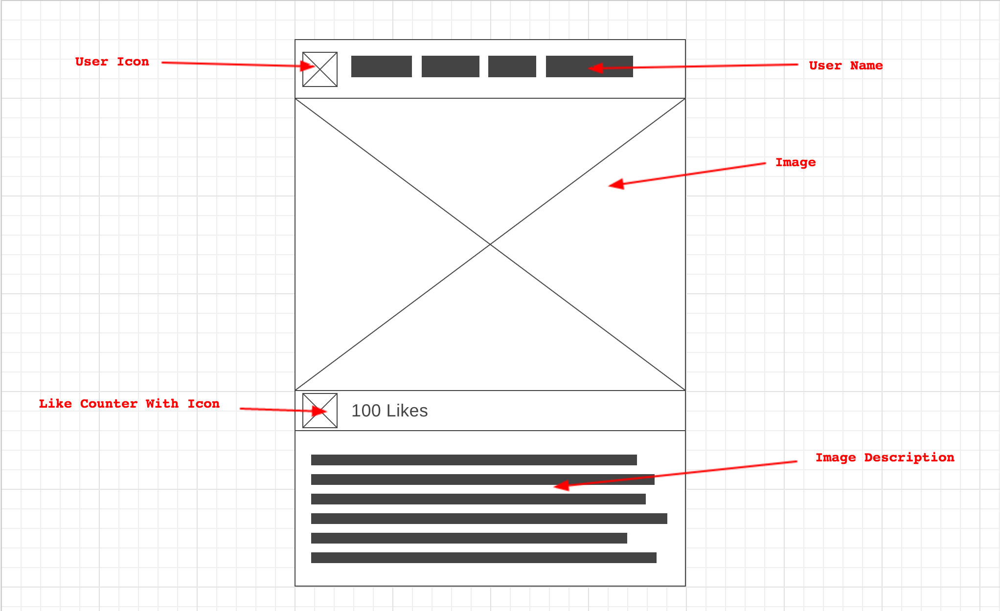

# instaGallery

## Description

This is frontend photo feed web app which renders posts from users and allows a user to like/unlike a post. The app is built in React and is my first application in this framework. It also incorporates some Bootstrap components for layout. It is designed to run with any JSON file which can be imported into `index.js` with associated images. This is also my first time using Jest and Enzyme testing frameworks producing test coverage of 100% on components.

See more about my [design process](#design-process).

This project was bootstrapped with [Create React App](https://github.com/facebookincubator/create-react-app).

## Setup

Check that you have node installed by running the below command

`$ node -v`

If not, install instructions can be found [here](https://nodejs.org/en/download/).

Clone the repo on the command line by running

`$ git clone git@github.com:ewintram/insta-gallery.git`

Install dependencies by running

`$ npm install`


## Usage

To launch the app, run

`$ npm start`

Navigate to `http://localhost:3000`





## Running tests

Testing is in Jest and Enzyme. To run the tests on the command line, run

`$ npm test`


## Author

Eleanor Wintram

## Design process



*Wireframe*

### User stories

**MVP**

```
As an instaGallery user,
I want to see a feed of photos from other users,
so that I can see what content users are sharing.
```

```
As an instaGallery user,
I want to see a photo another user has taken,
so that I can appreciate their photography.
```

**Version 1**

```
As an instaGallery user,
I want to see a user's alias/name,
so that I know who added the photo to the gallery.
```

```
As an instaGallery user,
I want to see a user's avatar,
So that I can familiarise myself with the user.
```

```
As an instaGallery user,
I want to see a description of the photo,
so that I learn more about the photo's content.
```

```
As an instaGallery user,
I want to the ability to like the photo,
so that I can show my appreciation for a photo that I like.
```

```
As an instaGallery user,
I want to the see how many likes a photo has,
so that I can see how popular a photo is with other users.
```

**Bonus stories**

```
As an instaGallery user,
I want to be able to unlike a photo in my feed,
so that I can undo a like made by accident.
```

```
As an instaGallery user,
I want to be able to delete a users card from my feed,
so that I have more control of the content I like.
```

**Still to implement**

I have started to create components for a comments feature but have yet to finalise the implementation and testing of this.
